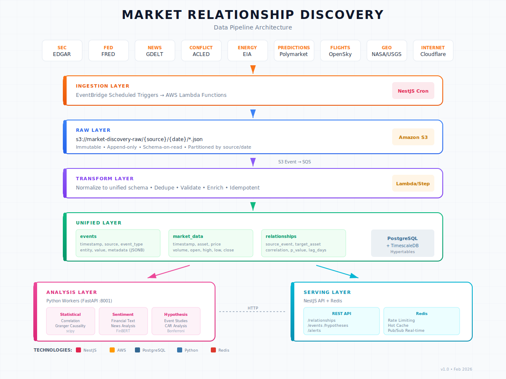

# Market Relationship Discovery Architecture



## Overview

A scalable data pipeline for market relationship discovery, ingesting data from multiple sources (EDGAR, FRED, GDELT, ACLED, etc.), unifying them into a common schema, and running statistical hypothesis testing to discover cross-asset signal relationships.

---

## High-Level Architecture

```
┌─────────────────────────────────────────────────────────────────────┐
│                           INGESTION LAYER                          │
│  ┌─────────┐ ┌─────────┐ ┌─────────┐ ┌─────────┐ ┌─────────┐       │
│  │  EDGAR  │ │  FRED   │ │  GDELT  │ │  ACLED  │ │  etc... │       │
│  └────┬────┘ └────┬────┘ └────┬────┘ └────┬────┘ └────┬────┘       │
│       │           │           │           │           │             │
│       └───────────┴───────────┴───────────┴───────────┘             │
│                               │                                     │
│                     EventBridge (scheduled)                         │
│                               │                                     │
│                        Lambda / ECS Tasks                           │
└───────────────────────────────┼─────────────────────────────────────┘
                                │
                                ▼
┌─────────────────────────────────────────────────────────────────────┐
│                           RAW LAYER (S3)                            │
│                                                                     │
│   s3://market-discovery-raw/edgar/2026/02/12/filings.json                    │
│   s3://market-discovery-raw/fred/2026/02/12/series.json                      │
│   s3://market-discovery-raw/gdelt/2026/02/12/events.json                     │
│                                                                     │
│   • Immutable, append-only                                          │
│   • Partitioned by source/date                                      │
│   • Schema-on-read                                                  │
└───────────────────────────────┼─────────────────────────────────────┘
                                │
                                │ S3 Event → SQS
                                ▼
┌─────────────────────────────────────────────────────────────────────┐
│                        TRANSFORM LAYER                              │
│                                                                     │
│   Lambda / Step Functions                                           │
│   • Normalize to unified schema                                     │
│   • Dedupe, validate, enrich                                        │
│   • Idempotent (rerunnable)                                         │
└───────────────────────────────┼─────────────────────────────────────┘
                                │
                                ▼
┌─────────────────────────────────────────────────────────────────────┐
│                     UNIFIED LAYER (PostgreSQL + TimescaleDB)        │
│                                                                     │
│   events                                                            │
│   ├── id (uuid)                                                     │
│   ├── timestamp (timestamptz)      ← TimescaleDB hypertable        │
│   ├── source (enum: edgar, fred, gdelt, ...)                       │
│   ├── event_type (text)            ← "insider_buy", "cpi_release"  │
│   ├── entity (text)                ← ticker, country, indicator    │
│   ├── value (numeric)              ← normalized value if applicable│
│   ├── metadata (jsonb)             ← source-specific fields        │
│   └── ingested_at (timestamptz)                                     │
│                                                                     │
│   market_data                                                       │
│   ├── timestamp, asset, price, volume, ...                         │
│                                                                     │
│   • Indexes on (source, event_type, timestamp)                      │
│   • TimescaleDB for time-series compression + fast range queries    │
└───────────────────────────────┼─────────────────────────────────────┘
                                │
                                ▼
┌─────────────────────────────────────────────────────────────────────┐
│                        ANALYSIS LAYER                               │
│                                                                     │
│   Python Analysis Worker (FastAPI server @ :8001)                   │
│   ├── Statistical Engine (scipy)                                    │
│   │   • Correlation tests (Pearson, Spearman)                       │
│   │   • Granger causality testing                                   │
│   │   • Event studies with CAR analysis                             │
│   │   • Lead/lag analysis, Bonferroni correction                    │
│   │                                                                 │
│   ├── Sentiment Analysis (FinBERT - FREE, no API costs)             │
│   │   • Financial text sentiment classification                     │
│   │   • Batch processing for news/SEC filings                       │
│   │                                                                 │
│   ├── Hypothesis Worker                                             │
│   │   • Fetches data from Postgres, runs tests                      │
│   │   • Creates relationships for significant findings              │
│   │                                                                 │
│   └── NestJS calls via HTTP: /hypothesis/run, /sentiment/analyze    │
└───────────────────────────────┼─────────────────────────────────────┘
                                │
                                ▼
┌─────────────────────────────────────────────────────────────────────┐
│                         SERVING LAYER                               │
│                                                                     │
│   NestJS API                                                        │
│   ├── /relationships      ← validated discoveries                   │
│   ├── /events             ← unified event stream                    │
│   ├── /hypotheses         ← test results                            │
│   └── /alerts             ← real-time signals                       │
│                                                                     │
│   Redis                                                             │
│   ├── Rate limiting                                                 │
│   ├── Hot cache (recent events, active alerts)                      │
│   └── Pub/sub for real-time                                         │
└─────────────────────────────────────────────────────────────────────┘
```

---

## Data Sources

| Source | Data Type | Frequency |
|--------|-----------|-----------|
| EDGAR | SEC filings, insider trades | Every 15 min |
| FRED | Federal Reserve economic data | Daily |
| GDELT | Global events, news | Every 15 min |
| ACLED | Conflict data | Weekly |
| OpenSky | Flight tracking | Real-time |
| NASA EONET/FIRMS | Natural events, fires | Daily |
| USGS | Earthquakes, geological | Real-time |
| EIA | Energy data | Weekly |
| Polymarket | Prediction markets | Real-time |
| Cloudflare Radar | Internet traffic patterns | Hourly |

---

## Scheduling

| Source | Frequency | Method |
|--------|-----------|--------|
| FRED | Daily | EventBridge → Lambda |
| EDGAR | Every 15 min | EventBridge → Lambda |
| GDELT | Every 15 min | EventBridge → Lambda |
| ACLED | Weekly | EventBridge → Lambda |
| Market data | Real-time | WebSocket → Redis → Postgres |
| Hypothesis tests | Daily (overnight) | Step Functions batch job |

---

## Key Design Decisions

### 1. Raw → Unified separation
- Never lose original data
- Can reprocess if schema evolves
- Audit trail

### 2. TimescaleDB over plain Postgres
- Native time-series compression (10x storage reduction)
- Fast range queries for backtesting
- Still PostgreSQL (TypeORM compatible)

### 3. Event-driven transforms
- S3 put → SQS → Lambda
- Decoupled, scalable, retryable

### 4. Unified schema with JSONB metadata
- Common fields for joins/queries
- Source-specific fields in metadata
- Flexible without schema explosion

### 5. Analysis as separate workers
- CPU-intensive stats in Python (scipy, pandas)
- Doesn't block API
- Can scale independently

### 6. Event-driven internal architecture
- NestJS EventEmitter for loose coupling
- Services emit events (event.created, relationship.discovered, etc.)
- Other services subscribe without direct dependencies
- Easy to add new reactions without modifying existing code

### 7. FinBERT for sentiment (not paid LLM APIs)
- FinBERT: free, open-source financial sentiment model
- Runs locally in Python worker
- No per-request API costs
- LLMs cannot reliably do math/find numerical patterns

### 8. LLM as optional orchestration layer (future)
- Core discovery is scipy-based (statistical, not LLM)
- LLM orchestration is an optional outer wrapper
- Agent pattern: LLM decides which scipy tools to invoke
- Not required for MVP - add when needed

---

## Unified Event Schema

```sql
CREATE TABLE events (
    id              UUID PRIMARY KEY DEFAULT gen_random_uuid(),
    timestamp       TIMESTAMPTZ NOT NULL,
    source          TEXT NOT NULL,          -- 'edgar', 'fred', 'gdelt', etc.
    event_type      TEXT NOT NULL,          -- 'insider_buy', 'cpi_release', etc.
    entity          TEXT,                   -- ticker, country, indicator
    value           NUMERIC,                -- normalized value if applicable
    metadata        JSONB,                  -- source-specific fields
    ingested_at     TIMESTAMPTZ DEFAULT NOW()
);

-- TimescaleDB hypertable for time-series optimization
SELECT create_hypertable('events', 'timestamp');

-- Indexes
CREATE INDEX idx_events_source_type ON events (source, event_type, timestamp DESC);
CREATE INDEX idx_events_entity ON events (entity, timestamp DESC);
```

---

## Scaling Path

| Stage | Data Volume | Approach |
|-------|-------------|----------|
| Now | GBs | Single Postgres, Lambda |
| 10x | 100s GB | TimescaleDB compression, read replicas |
| 100x | TBs | S3 + Athena for cold queries, Postgres for hot |
| 1000x | PBs | Snowflake/Redshift, Spark for analysis |

---

## Internal Communication

```
┌─────────────────────────────────────────────────────────────────────┐
│                         NestJS Backend                              │
│                                                                     │
│   ┌──────────────┐    EventEmitter    ┌──────────────┐             │
│   │ EventsModule │ ←───────────────→  │ AlertsModule │             │
│   └──────┬───────┘                    └──────────────┘             │
│          │                                   ↑                      │
│          │ event.created                     │ alert.triggered      │
│          ↓                                   │                      │
│   ┌──────────────┐                    ┌──────────────┐             │
│   │ Hypotheses   │ ←───────────────→  │ Relationships│             │
│   │ Module       │ relationship.      │ Module       │             │
│   └──────┬───────┘ discovered         └──────────────┘             │
│          │                                                          │
└──────────┼──────────────────────────────────────────────────────────┘
           │
           │ HTTP POST /hypothesis/run
           ↓
┌─────────────────────────────────────────────────────────────────────┐
│                    Python Analysis Worker                           │
│                         (FastAPI :8001)                             │
│                                                                     │
│   ┌────────────────┐    ┌────────────────┐    ┌────────────────┐   │
│   │ StatisticalAna │    │ SentimentAnaly │    │ HypothesisWork │   │
│   │ lyzer (scipy)  │    │ zer (FinBERT)  │    │ er             │   │
│   └────────────────┘    └────────────────┘    └────────────────┘   │
│                                                                     │
│   Endpoints:                                                        │
│   • POST /hypothesis/run      - Queue hypothesis test               │
│   • POST /stats/correlation   - Run correlation test                │
│   • POST /sentiment/analyze   - Analyze text sentiment              │
│                                                                     │
└─────────────────────────────────────────────────────────────────────┘
```

---

## Stack Summary

| Component | Technology |
|-----------|------------|
| Ingestion | NestJS scheduled services (cron) |
| Raw Storage | S3 (partitioned by source/date) |
| Queue | SQS (transform triggers) |
| Transform | Lambda or Step Functions |
| Database | PostgreSQL + TimescaleDB |
| Cache | Redis |
| Statistical Analysis | Python (scipy, statsmodels, pandas) |
| Sentiment Analysis | FinBERT (ProsusAI/finbert) - FREE |
| Analysis API | FastAPI (Python) @ port 8001 |
| API | NestJS + TypeORM + EventEmitter |
| Internal Events | @nestjs/event-emitter |
| LLM Orchestration | Optional future layer (Claude/GPT) |
| Infra | AWS CDK or Terraform |

---

## Diagram Note

The `architecture-diagram.png` shows the original high-level pipeline design. Key additions since then:
- **FinBERT** added to Analysis Layer for free sentiment analysis
- **FastAPI** server bridges NestJS ↔ Python analysis worker
- **EventEmitter** for internal event-driven architecture
- **LLM orchestration** marked as optional future layer (not core)
